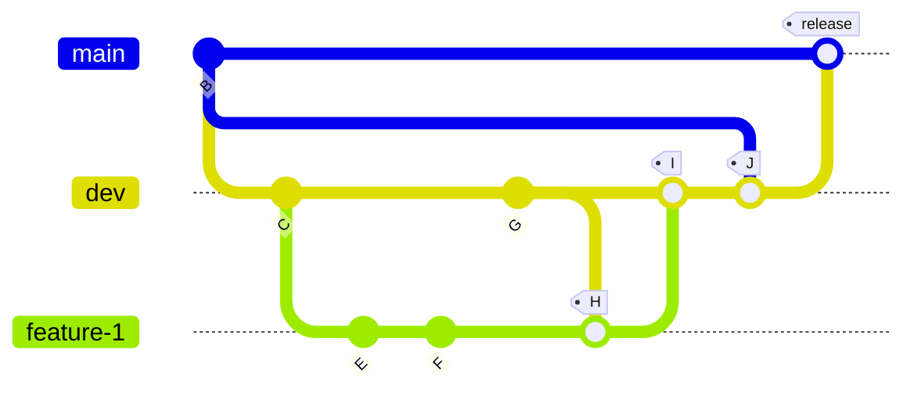
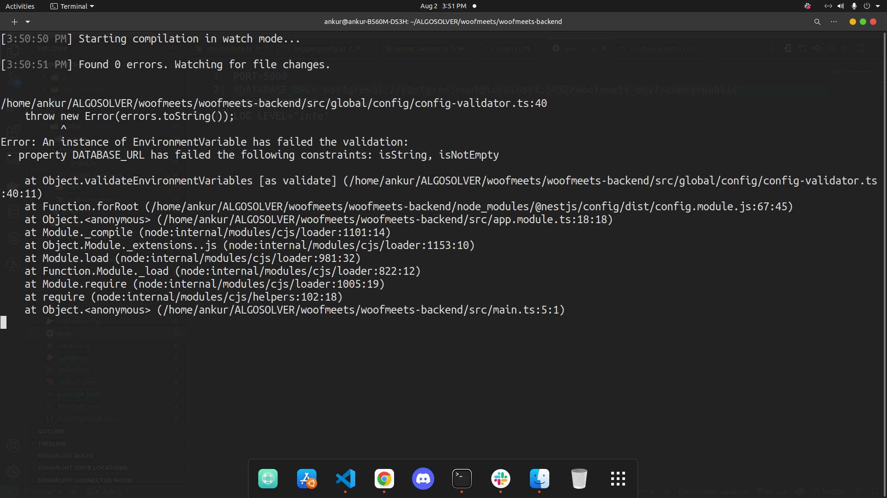
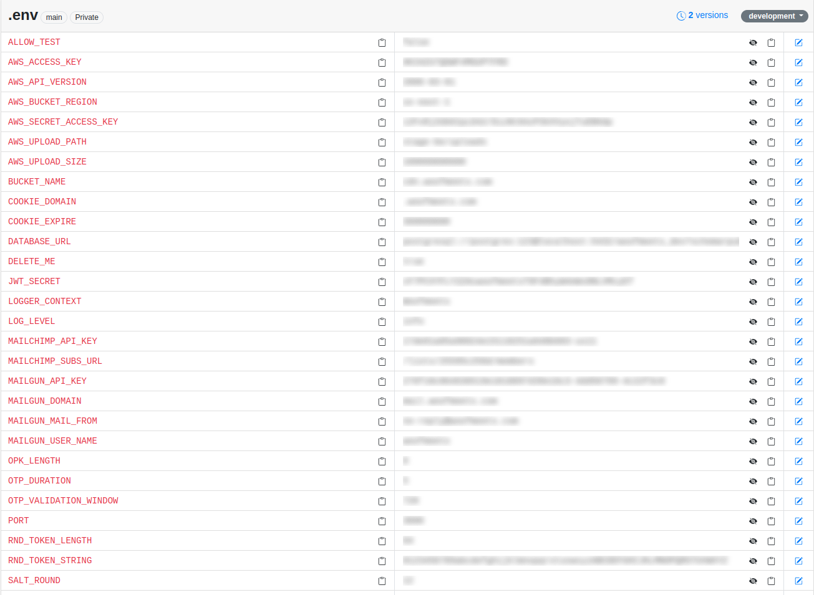

# Table of Contents

1. [Welcome to **Woofmeets Backend Setup**](#intro)
2. [Tools Required](#tools)
3. [Getting Started](#started)
4. [Committing Code](#commit)
5. [FAQ](#faq)

## Welcome to **Woofmeets Backend Setup** <a name="intro"></a>

[](https://conventionalcommits.org)

| :warning: **IMPORTANT** |
| ---- |
| [Credentials Repository](https://algosolver-llc.atlassian.net/wiki/spaces/WBD/pages/319455497/Platform+Credentials)     |
| [Confluence Page](https://algosolver-llc.atlassian.net/wiki/spaces/WBD/pages/319193150/Development+Roadmap)|
| [Woofmeets JIRA Board](https://algosolver-llc.atlassian.net/jira/software/c/projects/WOOF/boards/45)|

---

## Tools Required <a name="tools"></a>

| :warning: Important |
| --- |
| You will find important files here |

1. [x] Sep 1 2021: [Sync env here](#env-how-to) (***Deperecated*** [.env](https://drive.google.com/drive/folders/1qj65FuDoKqRkBur2JjVA_qhXryiQSv24?usp=sharing) Env file can be found  over here)
2. [x] [Confluence](https://algosolver-llc.atlassian.net/wiki/spaces/WBD/pages/319455497/Platform+Credentials) has important account links
3. [x] [Dotenv-vault](https://www.dotenv.org/docs/getting-started/with-dotenv-vault) Used to manage and **sync** .dotenv during development **LOGIN WITH dev@algosolver.com**

### VSCODE AND Database Tooling

1. [x] Prettier
2. [x] [Markdown Preview Enhanced](https://marketplace.visualstudio.com/items?itemName=shd101wyy.markdown-preview-enhanced)
3. [x] [Markdown Preview Mermaid Support](https://marketplace.visualstudio.com/items?itemName=bierner.markdown-mermaid)
4. [x] Dbeaver

### Development

1. [x] Postgres
    - [x] Postgres Geolocation tools
2. [x] Redis
3. [x] Node Js **LTS**
    - [x] Yarn
4. [x] Configured `.env` file  

### Production (Additionally)

1. [x] pm2 - Node process manager

---

## Getting Started <a name="started"></a>

### Development Server

```bash
yarn
yarn migrate
yarn dev
// http://localhost:5000/docs #(Access Swagger)
```

### Production Server

```bash
sudo yarn
sudo yarn dbdeploy
sudo yarn generate
sudo yarn build
sudo pm2 restart ecosystem.config.js
sudo systemctl restart nginx
```

---

## Committing Code <a name="commit"></a>



| ID | Feature |
| ---| ------- |
| H  | Pull in dev in your feature branch |
| I | Merged code after your MR is reviewed and accepted |
| J | Pull in master in dev and **resolve merge conflicts**
| release | Dev merged with main for production release |

| :exclamation: This is very important |
| ------------------------------------ |
| Please utilize conventional commits standard |

e.g. To commit code after adding your feature

```bash
git add feature
yarn run cm
```

---

## FAQ <a name="faq"></a>

### App crashing at startup

Please ensure that you're .env file is in sync

### Update .env file

1. [ ] [Go to validator config](./src/global/config/config-validator.ts) and then update the schema with proper validation 

2. [ ] [Go to Secret Service](./src/secret/secret.service.ts) and update the ***prepare*** method to refect the **EnvironmentVariable class**

3. [ ] [How to sync .env](https://www.dotenv.org/docs/getting-started/with-dotenv-vault) Login with the **dev@algosolver.com** account <a name="env-how-to"></a> 

```bash
npx dotenv-vault pull# opens browser to authenticate if not logged in
npx dotenv-vault open # shows .env in dashboard
```



> title: Senior Software Engineer
> author: Ankur Datta
> contact: ankur@algosolver.com
