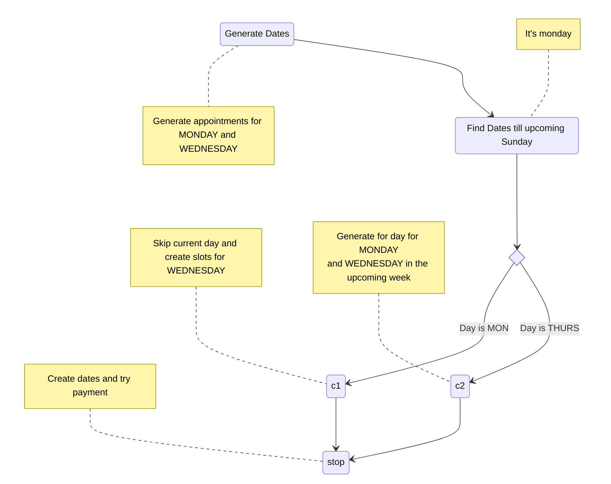

# Appointment Creation

Appointment creation can have two types:

1. Ranged (Fixed Appointments)
2. Recurring

## Appointment Creation Task

Generating dates and storing them in the `appointment_dates` table
[Check ER Schema](./appointment-system.MD?plain=1#L40)

Tasks:

- [ ] Check whether requested dates are holidays, if so apply rate multiplies effectively
- [ ] Calculate provider service fees and create corresponding appointments_dates
- [ ] If there are multiple visits in a day, the **multiple rows** in the `appointment_dates` table will be created in the timezone saved in the `appointment` table
- [ ] Have a **generated_till** along with **is_recurring** fields in the `appointment` table, so that we can create dates **only if** current dates

e.g. Suppose there are 2 visits (1:00PM-2:30PM, 3:00PM-4:30PM) on the 23rd of May, 2022 UTC-04:00, Neywork Time. Then the database would have. **The table below does NOT demonstrate all columns for the sake of brevity**

| | appointment_dates |  |  |
| --- | -----|  --- | --- |
| id | time | visitId | payment_status |
|--- | 2022-04-23T13:00:00.000-04:00 | 1 | unpaid |
|--- | 2022-04-23T15:00:00.000-04:00 | 2 | unpaid |

## Recurring Appointment Case

Appointments will be generation week is **SUN** to **SAT**

