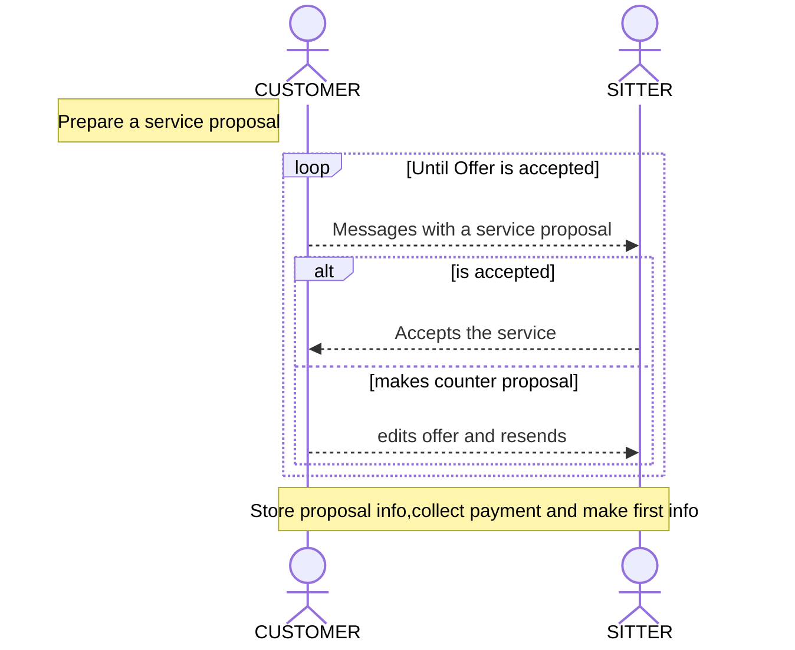
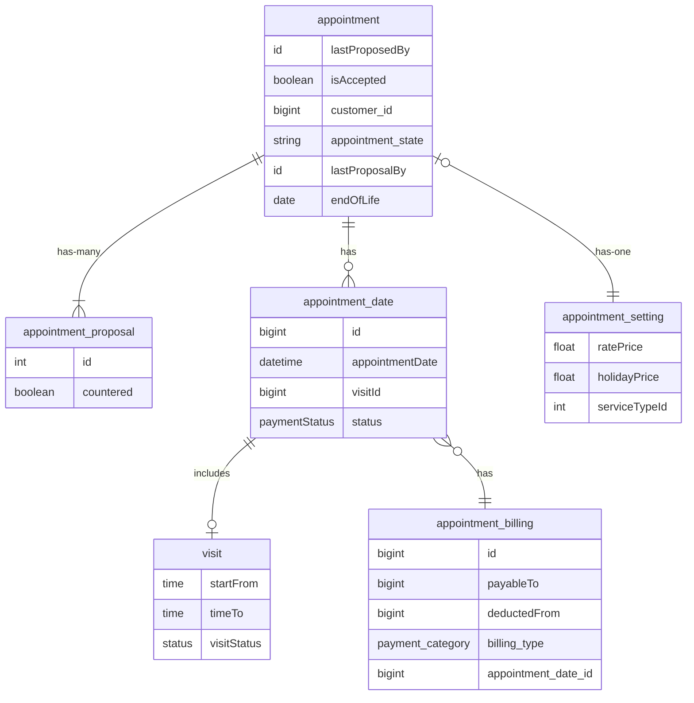

# Appointment System

This document identifies how the appointment system should work

## Proposal System

### Requirements

`Contact Sitters Page`

1. Customer will be able to choose **ONLY** the services which are provided by the sitter
2. Once customer sends the request the **NEGOTIATION STAGE** Begins

The **CUSTOMER** instiates the process, by propsing a date and time approaching the **SITTER**
The timezone used is the **SITTERS** Timezone

## Appointment System ERD

Usecase:

- [ ] When an new proposal is requested an **appoinment** will be created with a **PROPOSAL STATUS** and **appointment_proposal** will contain all the proposals from both parties  
- [ ] **appointment_setting** will store the final result of the negotiated terms, the provider pricing and the dates
- [ ] After propsal is accepted, the appointment dates will be created with **UNPAID_STATUS**

